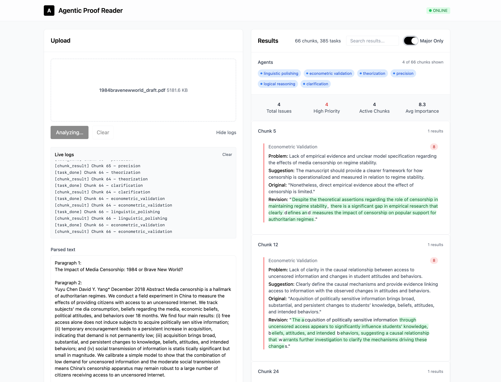

<!--
 * @Author: Rongxin rongxin@u.nus.edu
 * @Date: 2025-10-16 15:59:31
 * @LastEditors: Rongxin rongxin@u.nus.edu
 * @LastEditTime: 2025-10-16 22:09:36
 * @FilePath: /agentic-proof-reader/README.md
 * @Description: 这是默认设置,请设置`customMade`, 打开koroFileHeader查看配置 进行设置: https://github.com/OBKoro1/koro1FileHeader/wiki/%E9%85%8D%E7%BD%AE
-->
# Agentic Proof Reader

Proofreading your manuscript by six agents automatically.

Alpha dev version for personal use & mostly vibe-coded, without commitment for maintenance.



## Setup

1. Python 3.10+
2. Create venv and install:

```bash
python3 -m venv .venv
source .venv/bin/activate
pip install -r requirements.txt
```

3. Configure env:

```bash
cp .env.example .env
# Fill keys: OPENAI_API_KEY, ANTHROPIC_API_KEY, GOOGLE_API_KEY, or set OLLAMA_HOST
# Set LLM_PROVIDER=openai|anthropic|gemini|ollama
```

## Quick Start
```bash
python start.py
# open http://127.0.0.1:8000
```

## Tech Stacks
- **Web :** FastAPI, Uvicorn, Vue.js
- **LLM:** OpenAI, Anthropic, Google-GenerativeAI, Ollama
- **Document Parsing:** pdfminer.six, PyPDF2, markdown-it-py, markitdown
- **Agent:** Praison AI

Most importantly:
- **Vibe-coding**: Cursor.

## LICENSE
GNU GPLv3